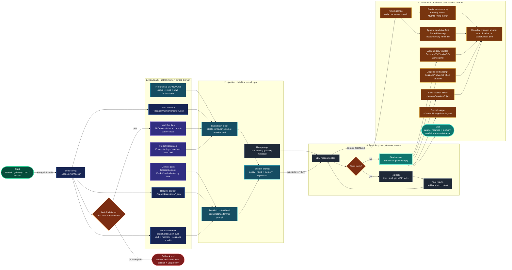

<p align="center">
  <br />
  <strong>Sanook CLI</strong>
  <br />
  <br />
  <em>The terminal AI coding agent with a memory that outlives the session.</em>
  <br />
  <br />
  <sub>Bring your own key · 9 providers · MCP · Obsidian second brain · gateway & cron</sub>
  <br />
  <br />
  🇹🇭 <a href="README.th.md">อ่านภาษาไทย</a>
</p>

<p align="center">
  <a href="https://www.npmjs.com/package/sanook-cli"></a>
  <a href="https://www.npmjs.com/package/sanook-cli"></a>
  <a href="LICENSE"></a>
  <a href="https://nodejs.org"></a>
  <a href="#development"></a>
  <a href="https://github.com/Sir-chawakorn/sanook-cli/actions/workflows/ci.yml"></a>
</p>

---

<h2 align="center" id="install">Install Sanook CLI</h2>

<p align="center">
  <strong>Pick one command below — all roads lead to <code>sanook</code>.</strong><br/>
  <sub>Requires <strong>Node.js ≥ 22</strong> &nbsp;·&nbsp; <code>node -v</code> to check &nbsp;·&nbsp; <code>npx sanook doctor</code> auto-fixes PATH / Node issues</sub>
</p>

<p align="center">
  
  &nbsp;
  
  &nbsp;
  
  &nbsp;
  
  &nbsp;
  
  &nbsp;
  
</p>

<br />

<table width="100%">
<tr>
<td width="50%" valign="top">

### 🍎 macOS · 🐧 Linux · WSL

**Recommended — npm**

```bash
npm install -g sanook-cli
# or run once without installing:
npx sanook-cli
```

**One-liner install script** *(checks Node, then installs via npm)*

```bash
# GitHub raw (default)
curl -fsSL https://raw.githubusercontent.com/Sir-chawakorn/sanook-cli/main/scripts/install.sh | bash

# GitHub Pages mirror
curl -fsSL https://sir-chawakorn.github.io/sanook-cli/install.sh | bash

# jsDelivr CDN
curl -fsSL https://cdn.jsdelivr.net/gh/Sir-chawakorn/sanook-cli@main/scripts/install.sh | bash
```

**Homebrew**

```bash
brew trust Sir-chawakorn/tap    # once on newer Homebrew
brew tap Sir-chawakorn/tap
brew install sanook-cli
```

</td>
<td width="50%" valign="top">

### 🪟 Windows

**Recommended — npm** *(PowerShell or cmd)*

```powershell
npm install -g sanook-cli
# or:
npx sanook-cli
```

**One-liner install script**

```powershell
# GitHub raw (default)
irm https://raw.githubusercontent.com/Sir-chawakorn/sanook-cli/main/scripts/install.ps1 | iex

# GitHub Pages mirror
irm https://sir-chawakorn.github.io/sanook-cli/install.ps1 | iex
```

**WinGet** *(after [PR #391114](https://github.com/microsoft/winget-pkgs/pull/391114) merges)*

```powershell
winget install Sanook.SanookCLI
```

Portable zip (no WinGet yet): [sanook-cli-win-x64.zip](https://github.com/Sir-chawakorn/sanook-cli/releases/download/v0.5.7/sanook-cli-win-x64.zip)

</td>
</tr>
</table>

<br />

<details open>
<summary><strong>📋 All install methods — status &amp; links</strong></summary>

| Method | Command | Status |
|--------|---------|--------|
| **npm / npx** | `npm install -g sanook-cli` | ✅ [npm](https://www.npmjs.com/package/sanook-cli) · latest **0.5.7** |
| **curl \| bash** | `curl -fsSL …/install.sh \| bash` | ✅ [raw](https://raw.githubusercontent.com/Sir-chawakorn/sanook-cli/main/scripts/install.sh) · [Pages](https://sir-chawakorn.github.io/sanook-cli/install.sh) · [jsDelivr](https://cdn.jsdelivr.net/gh/Sir-chawakorn/sanook-cli@main/scripts/install.sh) |
| **irm \| iex** | `irm …/install.ps1 \| iex` | ✅ [raw](https://raw.githubusercontent.com/Sir-chawakorn/sanook-cli/main/scripts/install.ps1) · [Pages](https://sir-chawakorn.github.io/sanook-cli/install.ps1) |
| **Homebrew** | `brew tap Sir-chawakorn/tap && brew install sanook-cli` | ✅ [homebrew-tap](https://github.com/Sir-chawakorn/homebrew-tap) |
| **GitHub Pages** | `curl -fsSL https://sir-chawakorn.github.io/sanook-cli/install.sh \| bash` | ✅ Live |
| **WinGet** | `winget install Sanook.SanookCLI` | ⏳ [PR #391114](https://github.com/microsoft/winget-pkgs/pull/391114) · CLA signed · [release zip](https://github.com/Sir-chawakorn/sanook-cli/releases/tag/v0.5.7) ready |
| **sanook.ai** *(optional short URL)* | `curl -fsSL https://sanook.ai/install.sh \| bash` | ⏳ DNS at GoDaddy → run `bash scripts/configure-sanook-ai-dns.sh` |

Full maintainer guide: **[docs/INSTALL_INFRA.md](docs/INSTALL_INFRA.md)**

</details>

<br />

> **Troubleshooting**
>
> | Symptom | Fix |
> |---------|-----|
> | `'sanook' is not recognized` | You ran `npm i sanook-cli` without `-g` — reinstall with `npm install -g sanook-cli`, or use `npx sanook` |
> | Node too old | Install [Node ≥ 22](https://nodejs.org) · scripts refuse older versions |
> | Homebrew refuses tap | Run `brew trust Sir-chawakorn/tap` once, then retry |
> | Not sure what's wrong | `npx sanook doctor` — prints OS-specific fixes (incl. Windows PATH one-liner) |

<br />

<p align="center">
  <a href="#quickstart"><strong>First run → setup wizard &amp; API key</strong></a>
</p>

---

<p align="center">
  <a href="#install"><strong>Install</strong></a>
  &nbsp;·&nbsp;
  <a href="#quickstart"><strong>Quickstart</strong></a>
  &nbsp;·&nbsp;
  <a href="#memory--second-brain"><strong>Memory</strong></a>
  &nbsp;·&nbsp;
  <a href="#persona"><strong>Persona</strong></a>
  &nbsp;·&nbsp;
  <a href="#dashboard"><strong>Dashboard</strong></a>
  &nbsp;·&nbsp;
  <a href="#providers"><strong>Providers</strong></a>
  &nbsp;·&nbsp;
  <a href="#usage"><strong>Usage</strong></a>
  &nbsp;·&nbsp;
  <a href="#gateway--scheduling"><strong>Gateway</strong></a>
  &nbsp;·&nbsp;
  <a href="#mcp"><strong>MCP</strong></a>
  &nbsp;·&nbsp;
  <a href="#security"><strong>Security</strong></a>
</p>

<!-- 📹 DEMO GIF — record the close-session → reopen → "it remembered" loop (asciinema + agg), save to docs/demo.gif, then uncomment: -->
<!-- <p align="center"></p> -->

<br />

## Overview

> **Close the terminal. Come back tomorrow. Sanook still knows what you decided.**

Sanook is a transparent coding agent for your terminal — one loop, no magic:

```text
prompt → LLM → tool call → result → loop → answer
```

Wrapped in the things real work needs: a permission gate, **structured memory across sessions**, a long-running gateway with cron and chat channels, on-demand skills, MCP servers, and first-class git awareness.

**BYOK by design.** Every provider uses a **direct API key from that provider's console** — Sanook never reuses OAuth or subscription credentials, because that violates provider terms and gets accounts banned.

## How it compares

The agent loop, BYOK, and MCP are table stakes now. What Sanook has that the big vendor CLIs don't is **memory that survives the session** — a structured Obsidian "second brain" the agent reads at the start of every run.

| | **Sanook** | Claude Code | Codex CLI | Gemini CLI |
|---|:---:|:---:|:---:|:---:|
| Open-source | ✅ | ❌ | ✅ | ✅ |
| Bring your own key | ✅ | — | ✅ | ✅ |
| Providers | **9** | 1 | 1 | 1 |
| Local models (Ollama / LM Studio) | ✅ | ❌ | ❌ | ❌ |
| MCP (stdio **+ remote HTTP**) | ✅ | ✅ | ✅ | ✅ |
| OS sandbox (Seatbelt / bubblewrap) | ✅ | ✅ | ✅ | ✅ |
| Checkpoint / rewind | ✅ | ✅ | ✅ | ✅ |
| Image / vision input | ✅ | ✅ | ✅ | ✅ |
| Prompt caching | ✅ | ✅ | ✅ | ✅ |
| **Durable cross-session memory** | ✅ | ❌ | ❌ | ❌ |
| **Local gateway + cron + messaging** | ✅ | ❌ | ❌ | ❌ |

On raw benchmark scores the frontier vendors win — Sanook's bet is **portability + persistent memory**, not beating Opus on SWE-bench. Use whatever fits; this one remembers.

## Memory & second brain

Sanook does **not** dump everything into one folder. Memory is layered — some lives in your Obsidian vault, some in `~/.sanook/` for speed and resume. Both are wired together at runtime.



**How to read the flow:** green nodes mark start/end, orange diamonds are decisions, blue nodes are local runtime state, purple nodes live inside the Obsidian-style vault, cyan nodes are injected into the system prompt, dark nodes are the active agent loop, amber nodes write memory back after/during the turn, and the red node is the safe fallback when no vault is configured.

### What goes where

| Data | Stored at | When | Purpose |
|---|---|---|---|
| **Worklog** | `{brainPath}/Sessions/YYYY-MM-DD-worklog.md` | After every agent turn (REPL + headless) | Daily trace of prompts & cost summary |
| **Full transcript** *(opt-in)* | `{brainPath}/Sessions/YYYY-MM-DD-<id>-chat.md` | After every turn, when `brainTranscript` is on | The actual conversation — your prompt **and** the AI's reply |
| **Session note** | `{brainPath}/Sessions/YYYY-MM-DD-<id>-session.md` | On REPL exit (`/quit` or Ctrl+C at empty prompt) | AI/heuristic summary + key facts |
| **Memory inbox** | `{brainPath}/Shared/Memory-Inbox/memory-inbox.md` | When the agent calls `remember` | Candidate facts for vault curation |
| **Project workspace** | `{brainPath}/Projects/<slug>/` | Setup wizard / `sanook brain init` links your repo | Project-scoped notes & hot context |
| **Persona profile** | `{brainPath}/Shared/User-Persona/persona.md` | `sanook persona` or `/persona` in REPL | Who you are + how you want the agent to work |
| **Auto-memory** | `~/.sanook/memory/memory.json` | When the agent calls `remember`, or `sanook persona` (protected) | Structured facts (merge, rank, inject) |
| **Session JSON** | `~/.sanook/sessions/*.json` | Every turn | `--continue` / `--resume` transcript |
| **Search index** | `~/.sanook/search/` | `sanook index` (incremental) | BM25 / hybrid retrieval |
| **Usage ledger** | `~/.sanook/usage/events.jsonl` | Every turn | Token/cost tracking — **not** semantic memory |

**Read at session start:** hierarchical `SANOOK.md` (global → project root → cwd), auto-memory block, vault hot files (`AI-Context-Index`, `current-state`, inbox, matched `Projects/<slug>/`), plus per-turn retrieval over vault + memory + past sessions.

**Setup links your repo to the vault:** the first-run wizard (or `sanook brain init`) saves `brainPath` in `~/.sanook/config.json`, scaffolds `Projects/<slug>/` inside the vault, and creates `SANOOK.md` in your repo if missing.

```bash
sanook brain init                  # pick vault folder + identity
sanook brain context               # inspect what gets injected from cwd
sanook brain projects list         # vault projects ↔ repo paths
sanook memory stats                # auto-memory store overview
sanook usage daily                 # token/cost ledger (ccusage-style)
```

**Want the entire conversation in your vault?** Turn on full transcripts — every prompt and reply is appended to `Sessions/*-chat.md` per session:

```bash
sanook config set brainTranscript on   # or env: SANOOK_BRAIN_TRANSCRIPT=1
```

> It is **opt-in** because verbatim transcripts of long coding sessions grow a vault fast. Worklog (always on) keeps a lighter daily trace; the full transcript is the complete record.

Disable persistence: `SANOOK_DISABLE_PERSISTENCE=1` · worklog only: `SANOOK_DISABLE_WORKLOG=1` · usage ledger: `SANOOK_DISABLE_USAGE=1`

## Quickstart

Already installed? Jump straight to setup — see **[Install](#install)** if you haven't yet.

Run the setup wizard or set an API key manually:

```bash
sanook setup                    # provider + model wizard; offers to create a second brain
sanook model                    # re-run provider/model setup later
sanook persona                  # tell the agent who you are + how you like to work
sanook auth add anthropic --api-key sk-ant-... --use

export ANTHROPIC_API_KEY=sk-ant-...        # macOS / Linux
setx ANTHROPIC_API_KEY "sk-ant-..."        # Windows (export won't work in cmd) — then open a NEW terminal

sanook "read package.json and list the dependencies"
```

Run `sanook` with no task to drop into an interactive REPL. On the very first run with no key configured, a setup wizard walks you through picking a provider, pasting a key, and choosing a model.

```bash
sanook                          # interactive REPL
sanook "fix the failing test"   # one-shot, headless
sanook chat -q "fix the failing test" --provider anthropic
sanook -z "summarise the diff"  # one-shot, final output only
sanook --json "..."             # JSONL output for CI / scripts
sanook status                   # redacted provider/key/brain/gateway status
sanook web status               # true web-search/fetch readiness + grounding policy
sanook sessions                 # list saved sessions for this project
sanook --resume <session_id> "continue here"
sanook dump                     # support snapshot; raw secrets are never printed
```

## Features

| Area | What you get |
|---|---|
| **Agent loop** | Built on the Vercel AI SDK 6 (`streamText` + `stopWhen` + `fullStream`), with streamed output, a cost meter, a budget cap, Anthropic **prompt caching** on the static preamble, and rate-limit-aware retry/backoff (distinct from auth failures) with model fallback. |
| **Tools** | `read_file` · `write_file` · `edit_file` (multi-tier matcher) · `list_dir` · `glob` · `grep` · `run_bash` · `run_python` · `run_rust`, plus git tools — gated by a permission layer that denies destructive commands, protected paths, and paths outside the workspace/brain by default. Non-bash tools are timeout-guarded so a runaway read/grep can't hang the loop. |
| **Sandbox** | `run_bash` is confined by an OS sandbox — **Seatbelt** on macOS, **bubblewrap** on Linux — so shell writes stay inside the workspace/brain/tmp (reads + network unaffected). Opt out with `SANOOK_NO_SANDBOX=1`. |
| **Approval** | `ask` mode is the default and prompts `y/n` before any file write or shell command. `--yes` for auto-approve; headless ask-mode safely denies mutations when no approval UI exists. |
| **Input** | Multiline editing, `↑`/`↓` persisted prompt history, readline keys (Ctrl-A/E/U/K/W), and `@file` mentions that inline a file's contents (or attach an **image** for vision-capable models). |
| **Checkpoint** | A shadow-git snapshot is taken before each turn; `/rewind` restores the files **and** truncates the conversation — recoverable (it stashes the current state first). |
| **Memory** | Layered memory: `remember` / `recall`, hierarchical `SANOOK.md`, Obsidian vault injection, per-turn retrieval, `--continue` / `--resume`, session notes on exit, daily worklogs, and `sanook memory` / `sanook usage` inspect commands. |
| **Familiar CLI surfaces** | `sanook setup`, `sanook model`, `sanook auth`, `sanook chat -q`, `sanook gateway`, `sanook status`, `sanook sessions`, `sanook dump`, `sanook tools`, and `sanook send` provide familiar management entry points, all Sanook-branded. |
| **Startup cockpit** | The interactive REPL opens with a Sanook-branded wordmark, service routes (Code, Brain, Connect, Ship), and live readiness signals for second-brain, MCP servers, installed skills, and the current git branch. |
| **Web grounding** | `sanook web status` separates local brain search from true internet search, detects configured MCP web/search/fetch candidates, and prints Sanook's citation + prompt-injection policy for current external facts. |
| **Repo map** | A lightweight symbol map of the repo (zero-dep, git-aware) is injected at session start so the agent picks the right files without blind grepping. |
| **Skills** | Built-in skills + install your own from a GitHub repo, URL, or local path. The agent can also author new skills after a repeatable task. |
| **Custom commands** | Drop a `.sanook/commands/<name>.md` prompt template and call it as `/<name>` (project commands require trust). Arguments replace `$ARGUMENTS` or `{{ args }}`; without a placeholder they are appended. |
| **Subagents** | A `task` tool spawns a fresh-context sub-agent for scoped exploration without bloating the main context — read-only by default, depth-guarded. |
| **Gateway + cron** | `sanook gateway run` (alias: `sanook serve`) runs a long-lived daemon: a loopback OpenAI-compatible HTTP endpoint plus a cron scheduler. Scheduled tasks can use `--to` to deliver results back through the messaging gateway. |
| **Channels** | `sanook gateway setup telegram|discord|slack|mattermost|homeassistant|email|line|sms|ntfy|signal|whatsapp|matrix|googlechat|bluebubbles|teams|webhooks` stores messaging adapter config, and `sanook gateway run` starts Telegram long-polling, lightweight Discord Gateway / Slack Socket Mode / Mattermost REST+WebSocket adapters, Home Assistant state-change WebSocket filters, Email IMAP polling, LINE webhooks, Twilio SMS webhooks, ntfy topic streams, Signal via `signal-cli` HTTP/SSE, WhatsApp Cloud webhooks, Matrix Client-Server sync, and generic event webhooks when configured. Chat/event history is persisted per platform target, and final responses of `[SILENT]`, `SILENT`, `NO_REPLY`, or `NO REPLY` are stored but not delivered. `sanook send --to telegram|discord|slack|mattermost|homeassistant|email|line|sms|ntfy|signal|whatsapp|matrix|googlechat|bluebubbles|teams`, `sanook webhook subscribe`, and `sanook cron add --to ...` use the same outbound delivery rules. |
| **MCP** | Connect any Model Context Protocol server over **stdio or remote Streamable-HTTP** (filesystem, GitHub, Postgres, hosted servers, …) via `~/.sanook/mcp.json`. |
| **Git** | Branch, uncommitted changes, and recent commits are injected automatically, with `git_status` / `git_diff` / `git_log` / `git_commit` tools. |
| **Hooks** | Run your own command before/after any tool. A non-zero `PreToolUse` exit blocks the tool — enforce lint, format, or policy. |
| **Plan mode** | `--plan` restricts the agent to read-only tools and asks it to produce a plan before touching anything. |
| **Auto-compaction** | A token-aware sliding window keeps long sessions under the context limit with zero extra LLM cost. |
| **Prompt budget inspectability** | `sanook prompt-size [--json]` reports the offline size of Sanook's system prompt, personality overlay, auto-memory, skills index, second-brain context, project memory, repo map, git context, and built-in tool schemas. |
| **Polyglot runtime surface** | `sanook runtimes [--json]` shows optional Python/Rust readiness. The agent gets `run_python` for data/document/ML-style helper scripts and `run_rust` for small performance/safety-critical helpers, both approval-gated and no-shell. |
| **Second brain** | `sanook brain init` scaffolds a structured Obsidian "second-brain" workspace (folders + `_Index` + a portable AI operating constitution) for organising work and giving the agent durable, cross-session memory. |
| **Self-improvement** | Sanook watches for repeated tasks and, past a threshold, **auto-authors a skill** for the pattern — announced in the terminal and surfaced on the Dashboard. Tune with `SANOOK_SELF_IMPROVE_THRESHOLD`; disable with `SANOOK_DISABLE_SELF_IMPROVE=1`. |
| **Persona** | `sanook persona` runs a short questionnaire (who you are, language, tone, autonomy, stack, preferences) and stores the answers as **protected memory** plus a vault profile so every session starts in context. |

## Persona

Teach the agent who you are once, and it carries that context into every session — name, language, tone, autonomy, your stack, and what you like (or don't like) it to do.

```bash
sanook persona                  # short questionnaire (A/B/C/D + free-text)
# or /persona inside the REPL — pre-fills from existing profile
```

A mix of multiple-choice and free-text questions. Answers are saved in two places, wired into the agent automatically:

- **Auto-memory** (`~/.sanook/memory/memory.json`) as **protected, owner-trust facts** — injected at the start of every run, so the agent immediately knows how to address you and how you want it to work.
- **Second brain** (`{brainPath}/Shared/User-Persona/persona.md`) as a readable profile note you can edit by hand — written only when a vault exists.

Re-run any time to update; existing answers are **pre-filled** from `persona.md` and protected memory. Blanks are skipped, and the vault profile is rewritten in place. The brain wizard (`sanook brain init`) already seeds a lighter identity (name + AI name + autonomy); `sanook persona` is the deeper, standalone pass.

## Dashboard

A local, Hermes-style admin panel for everything the CLI knows — open it in a browser and drive Sanook without leaving the page.

```bash
sanook dashboard                # http://127.0.0.1:9119
sanook dashboard --port 8080
```

| Page | What it shows |
|---|---|
| **Terminal** | A real web terminal — an **Agent console** (the Sanook REPL, streamed over SSE with live tool activity + color-coded diffs) and an optional **Raw shell** (a system PTY via `xterm.js`, enabled when the `node-pty` + `ws` optional deps are installed). |
| **Skills** | Built-in and installed skills, including the ones Sanook auto-authored from repeated tasks. |
| **Memory** | Your structured auto-memory facts (incl. persona) with tier/trust. |
| **Persona** | Your saved persona profile (`sanook persona` / `/persona`) — view answers and profile path. |
| **Usage** | Token/cost ledger, daily/weekly/monthly. |
| **Self-improve** | The task ledger — what's repeating and which skills were created. |
| **Install** | The multi-platform install commands (see [Quickstart](#quickstart)), with copy buttons. |
| **Sessions · Models · Files · Logs · Cron · Channels · Config · MCP · Brain** | Inspect and manage the same surfaces as the CLI. |

It binds to **loopback only** and reads the same `~/.sanook/` state as the CLI, so the Dashboard and terminal always agree.

## Providers

One model spec, nine providers. Switch with `-m <spec>` on the command line or `/model` in the REPL.

| Provider | Spec example | Key |
|---|---|---|
| Anthropic (Claude) | `-m sonnet`, `-m opus`, `-m haiku` | `ANTHROPIC_API_KEY` |
| Google (Gemini) | `-m gemini`, `-m google:gemini-2.5-flash` | `GOOGLE_GENERATIVE_AI_API_KEY` |
| OpenAI | `-m gpt`, `-m openai:gpt-5.5` | `OPENAI_API_KEY` |
| xAI (Grok) | `-m grok` | `XAI_API_KEY` |
| Mistral | `-m mistral` | `MISTRAL_API_KEY` |
| Groq | `-m groq:fast` | `GROQ_API_KEY` |
| Ollama | `-m ollama` | — (local) |
| LM Studio | `-m lmstudio` | — (local) |
| OpenAI Codex | `-m codex` | via the official Codex CLI |

A spec is an alias (`sonnet`), a `provider:model-id` pair (`openai:gpt-5.5`), or a bare model id. `sanook models <provider>` lists the curated ids and, when a key is set, verifies them against the provider's live `/models` endpoint.

```bash
sanook models                 # list all providers
sanook models anthropic       # curated ids (+ live verification if a key is set)
sanook auth list              # redacted key status for every provider
sanook auth status openai     # env/store/console details
```

## Usage

```
sanook "<task>"          run one task (headless)
sanook -z "<task>"       one-shot final output (script-friendly)
sanook chat -q "<query>" direct one-shot query
sanook                   interactive REPL
sanook setup [section]   setup model/gateway/tools/agent/brain
sanook model             choose provider + model
sanook persona           questionnaire → durable persona (memory + second brain)
sanook dashboard [--port] local web admin UI (terminal, skills, memory, usage, install)
sanook status            redacted install/config status
sanook auth list         redacted provider key status
sanook auth add openai --api-key <key> [--use]
sanook sessions          list saved sessions for this project
sanook sessions show <id>
sanook sessions export <id> [--format json|markdown] [--output path]
sanook sessions rename <id> <title>
sanook sessions stats [--all]
sanook sessions prune --keep N [--all] [--yes]
sanook sessions rm <id>
sanook dump [--show-keys] support dump (keys are still redacted)
sanook usage [daily|weekly|monthly|session] [--days N] [--json]
sanook prompt-size [--json] inspect system/brain/skill/tool context budget
sanook runtimes [--json]   inspect optional Python/Rust runtime surface
sanook web status [--json] inspect true web-search/fetch readiness
sanook web doctor [--json] probe web/search/fetch MCP candidates
sanook -c "<task>"       resume the latest session for this project
sanook --resume <id>     resume a specific saved session
sanook --continue-any    resume the newest session across all projects
sanook --plan "<task>"   plan mode (read-only)
sanook --json "<task>"   JSONL output for scripts / CI
sanook update            update the CLI to the latest npm release

  -m, --model <spec>     model or provider:model-id
      --provider <id>    provider shortcut for `sanook chat`
  -b, --budget <usd>     stop when estimated cost exceeds this
  -y, --yes              auto-approve tool calls (skip ask-mode)
      --yolo             alias for --yes
  -v, --version          print version
  -h, --help             show help
```

**REPL slash commands:** `/new` · `/reset` · `/status` · `/model` · `/personality` · `/platforms` · `/tools` · `/skills` · `/cost` · `/usage` · `/insights` · `/diff` · `/retry` · `/stop` · `/undo` · `/rewind` · `/clear` · `/compact` · `/compress` · `/help` · `/quit` — plus your own `.sanook/commands/*.md`. Input supports `↑`/`↓` history, `@file` mentions (text or image), and multiline (trailing `\` or Alt+Enter).

## Updating

Use the built-in updater whenever a new CLI version is available:

```bash
sanook update
sanook update --check   # check only
```

It checks the npm `latest` release for `sanook-cli` and, when newer than your installed version, runs `npm install -g sanook-cli@latest`.

When you launch the interactive TUI with plain `sanook`, the CLI checks for updates at most once per day. If a newer version exists, it asks `Yes/No` before running the same updater. Set `SANOOK_DISABLE_UPDATE_CHECK=1` to silence the prompt.

## Gateway & scheduling

`sanook gateway run` starts a single long-lived foreground process that hosts an HTTP API, a cron scheduler, and optional chat channels — all driving the same agent core. `sanook gateway start` runs the same gateway in the background and records its pid/log path under `~/.sanook/gateway/`. `sanook serve` remains as a compatibility alias.

```bash
sanook gateway status                          # redacted gateway config + token path
sanook gateway run --port 8787                 # HTTP (127.0.0.1 only) + scheduler
sanook gateway start --port 8787               # background process + pid/log tracking
sanook gateway stop
sanook gateway restart
sanook gateway install                         # write launchd/systemd helper file
sanook serve --port 8787                       # compatibility alias
sanook cron add "every 30m" "check the CI"     # also "09:00", an ISO time, or "now"
sanook cron add "every 30m" "check the CI" --to slack:C01ABCDEF
sanook cron add "09:00" "summarise calendar" --to email:owner@example.com --model openai:gpt-5.1
sanook cron list
sanook cron rm <id>
```

The HTTP server binds to **loopback only** and authenticates every endpoint (except `/health`) with a bearer token stored at `~/.sanook/gateway/token` (chmod 600). It runs mutating tools in `ask` mode by default; opt into unattended writes with `sanook config set permissionMode auto` or `SANOOK_GATEWAY_ALLOW_WRITE=1`. It speaks the OpenAI chat-completions shape, so existing clients work unchanged:

```bash
curl http://127.0.0.1:8787/v1/chat/completions \
  -H "Authorization: Bearer $(cat ~/.sanook/gateway/token)" \
  -H 'content-type: application/json' \
  -d '{"messages":[{"role":"user","content":"summarise today's commits"}]}'
```

| Method | Endpoint | Purpose |
|---|---|---|
| `GET` | `/health` | liveness (public) |
| `POST` | `/v1/chat/completions` | run the agent (OpenAI-compatible) |
| `GET` / `POST` | `/tasks` | list / enqueue scheduled tasks |

### Messaging channels

Use the setup command, or set environment variables before `sanook gateway run`. Telegram uses long-polling (no public URL needed), Discord uses the Gateway websocket, Slack uses Socket Mode, Mattermost uses REST API v4 plus websocket events, Home Assistant uses `/api/websocket` for watched `state_changed` events plus REST `persistent_notification.create` for replies, Email uses IMAP polling plus SMTP threaded replies, LINE uses the official Messaging API webhook + Reply/Push endpoints, SMS uses Twilio Programmable Messaging with `X-Twilio-Signature` validation, ntfy uses the HTTP JSON stream + publish API, Signal uses `signal-cli daemon --http` with JSON-RPC + Server-Sent Events, WhatsApp Cloud uses Meta's official webhook + Graph Messages API, Matrix uses the Matrix Client-Server sync/send API, Google Chat uses incoming webhooks or service-account Chat REST API sends with Pub/Sub config saved for future inbound, BlueBubbles/iMessage uses the BlueBubbles REST API for outbound text with webhook settings saved for inbound parity, Microsoft Teams supports Incoming Webhook delivery and Graph chat/channel delivery, and generic Webhooks accept GitHub/GitLab/Jira/Stripe-style events with HMAC validation.

```bash
sanook gateway setup                           # platform menu
sanook gateway setup telegram --bot-token 123:abc --allowed-chats 5222385839
sanook gateway setup discord --bot-token "$DISCORD_BOT_TOKEN" --channel 123456789012345678
sanook gateway setup slack --bot-token "$SLACK_BOT_TOKEN" --app-token "$SLACK_APP_TOKEN" --channel C01ABCDEF
sanook gateway setup mattermost --url https://mm.example.com --token "$MATTERMOST_TOKEN" \
  --allowed-users user_id_1 --home-channel chan_home_id --thread-replies
sanook gateway setup homeassistant --url http://homeassistant.local:8123 --token "$HASS_TOKEN" \
  --home-channel sanook_agent --watch-domains light,binary_sensor,climate
sanook gateway setup email --address bot@example.com --password "$EMAIL_PASSWORD" \
  --imap-host imap.example.com --smtp-host smtp.example.com --home-address owner@example.com
sanook gateway setup line --channel-access-token "$LINE_CHANNEL_ACCESS_TOKEN" \
  --channel-secret "$LINE_CHANNEL_SECRET" --home-channel U1234567890abcdef
sanook gateway setup sms --account-sid "$TWILIO_ACCOUNT_SID" --auth-token "$TWILIO_AUTH_TOKEN" \
  --phone-number "$TWILIO_PHONE_NUMBER" --home-channel +15551234567 \
  --webhook-url https://your-tunnel.example.com/sms/webhook
sanook gateway setup ntfy --topic sanook-yourname-2026 --token "$NTFY_TOKEN" --markdown
sanook gateway setup signal --account +15550000000 --home-channel +15551234567 \
  --http-url http://127.0.0.1:8080
sanook gateway setup whatsapp --phone-number-id "$WHATSAPP_CLOUD_PHONE_NUMBER_ID" \
  --access-token "$WHATSAPP_CLOUD_ACCESS_TOKEN" --app-secret "$WHATSAPP_CLOUD_APP_SECRET" \
  --home-channel 15551234567 --public-url https://your-tunnel.example.com
sanook gateway setup matrix --homeserver https://matrix.example.org \
  --access-token "$MATRIX_ACCESS_TOKEN" --allowed-users @alice:matrix.org \
  --home-room '!abc123:matrix.example.org'
sanook gateway setup googlechat --service-account-json "$GOOGLE_CHAT_SERVICE_ACCOUNT_JSON" \
  --home-channel spaces/AAAA --allowed-spaces spaces/AAAA
sanook gateway setup googlechat --incoming-webhook-url "$GOOGLE_CHAT_INCOMING_WEBHOOK_URL"
sanook gateway setup bluebubbles --server-url http://localhost:1234 --password "$BLUEBUBBLES_PASSWORD" \
  --home-channel user@example.com --allowed-users user@example.com,+15551234567
sanook gateway setup teams --incoming-webhook-url "$TEAMS_INCOMING_WEBHOOK_URL"
sanook gateway setup teams --delivery-mode graph --graph-access-token "$TEAMS_GRAPH_ACCESS_TOKEN" \
  --chat-id '19:chatid@thread.v2'
sanook gateway setup webhooks --secret "$WEBHOOK_SECRET" --public-url https://your-tunnel.example.com
sanook webhook subscribe github-issues --events issues \
  --prompt "New issue #{issue.number}: {issue.title}\n{issue.html_url}" --to slack:C01ABCDEF
sanook webhook subscribe deploy-notify --events push --deliver-only \
  --prompt "Push to {repository.full_name}: {head_commit.message}" --to sms
sanook gateway run
sanook send --to telegram "deploy finished"
sanook send --to discord "deploy finished"
sanook send --to slack:C01ABCDEF "deploy finished"
sanook send --to mattermost:chan_home_id "deploy finished"
sanook send --to homeassistant:doorbell "deploy finished"
sanook send --to email:owner@example.com --subject "[CI]" "deploy finished"
sanook send --to line "deploy finished"
sanook send --to sms "deploy finished"
sanook send --to ntfy "deploy finished"
sanook send --to signal "deploy finished"
sanook send --to whatsapp "deploy finished"
sanook send --to matrix "deploy finished"
sanook send --to matrix:'!ops:matrix.example.org' "deploy finished"
sanook send --to googlechat "deploy finished"
sanook send --to googlechat:spaces/AAAA/threads/thread-1 "threaded update"
sanook send --to bluebubbles "deploy finished"
sanook send --to bluebubbles:'iMessage;-;user@example.com' "deploy finished"
sanook send --to teams "deploy finished"
sanook send --to teams:'19:chatid@thread.v2' "deploy finished"
sanook cron add "every 30m" "check the CI" --to line
sanook cron add "09:00" "daily check-in" --to sms
sanook cron add "09:00" "daily check-in" --to ntfy
sanook cron add "09:00" "daily check-in" --to mattermost
sanook cron add "09:00" "daily check-in" --to homeassistant
sanook cron add "09:00" "daily check-in" --to signal
sanook cron add "09:00" "daily check-in" --to whatsapp
sanook cron add "09:00" "daily check-in" --to matrix
sanook cron add "09:00" "daily check-in" --to googlechat
sanook cron add "09:00" "daily check-in" --to bluebubbles
sanook cron add "09:00" "daily check-in" --to teams
sanook send --to telegram --subject "[CI]" --file build.log
echo "RAM 92%" | sanook send --to telegram --quiet
sanook send --to telegram:5222385839:17585 "threaded reply"
sanook webhook list
sanook webhook test github-issues --payload '{"event_type":"issues","issue":{"number":42,"title":"Test"}}'
sanook send --list --json
```

Environment overrides still work:

```bash
export TELEGRAM_BOT_TOKEN=123:abc
export TELEGRAM_ALLOWED_CHATS=5222385839   # required — comma-separated chat ids
export LINE_CHANNEL_ACCESS_TOKEN=xxx
export LINE_HOME_CHANNEL=U1234567890abcdef
export TWILIO_ACCOUNT_SID=ACxxxxxxxxxxxxxxxxxxxxxxxxxxxxxxxx
export TWILIO_AUTH_TOKEN=xxx
export TWILIO_PHONE_NUMBER=+15550000000
export SMS_HOME_CHANNEL=+15551234567
export SMS_WEBHOOK_URL=https://your-tunnel.example.com/sms/webhook
export NTFY_TOPIC=sanook-yourname-2026
export NTFY_ALLOWED_USERS=sanook-yourname-2026
export NTFY_HOME_CHANNEL=sanook-yourname-2026
export MATTERMOST_URL=https://mm.example.com
export MATTERMOST_TOKEN=xxx
export MATTERMOST_HOME_CHANNEL=chan_home_id
export MATTERMOST_ALLOWED_USERS=user_id_1,user_id_2
export MATTERMOST_ALLOWED_CHANNELS=chan_home_id,chan_ops_id
export MATTERMOST_REQUIRE_MENTION=true
export MATTERMOST_REPLY_MODE=thread
export HASS_URL=http://homeassistant.local:8123
export HASS_TOKEN=xxx
export HASS_HOME_CHANNEL=sanook_agent
export HASS_WATCH_DOMAINS=light,binary_sensor,climate
export HASS_WATCH_ENTITIES=sensor.temp,alarm_control_panel.home
export HASS_COOLDOWN_SECONDS=30
export SIGNAL_HTTP_URL=http://127.0.0.1:8080
export SIGNAL_ACCOUNT=+15550000000
export SIGNAL_HOME_CHANNEL=+15551234567
export SIGNAL_ALLOWED_USERS=+15551234567
export SIGNAL_GROUP_ALLOWED_USERS=groupIdBase64
export WHATSAPP_CLOUD_PHONE_NUMBER_ID=123456789012345
export WHATSAPP_CLOUD_ACCESS_TOKEN=EAA...
export WHATSAPP_CLOUD_APP_SECRET=xxx
export WHATSAPP_CLOUD_VERIFY_TOKEN=choose-a-long-random-token
export WHATSAPP_CLOUD_HOME_CHANNEL=15551234567
export WHATSAPP_CLOUD_ALLOWED_USERS=15551234567,15557654321
export WHATSAPP_CLOUD_PUBLIC_URL=https://your-tunnel.example.com
export WHATSAPP_CLOUD_API_VERSION=v20.0
export MATRIX_HOMESERVER=https://matrix.example.org
export MATRIX_ACCESS_TOKEN=syt_...
export MATRIX_USER_ID=@sanook:matrix.example.org
export MATRIX_HOME_ROOM='!abc123:matrix.example.org'
export MATRIX_ALLOWED_USERS=@alice:matrix.org,@bob:matrix.org
export MATRIX_ALLOWED_ROOMS='!abc123:matrix.example.org,!ops:matrix.example.org'
export MATRIX_REQUIRE_MENTION=true
export MATRIX_FREE_RESPONSE_ROOMS='!free:matrix.example.org'
export TEAMS_DELIVERY_MODE=incoming_webhook
export TEAMS_INCOMING_WEBHOOK_URL=https://...
export TEAMS_GRAPH_ACCESS_TOKEN=xxx
export TEAMS_CHAT_ID='19:chatid@thread.v2'
export TEAMS_HOME_CHANNEL='19:chatid@thread.v2'
export WEBHOOK_ENABLED=true
export WEBHOOK_SECRET=xxx
export WEBHOOK_PUBLIC_URL=https://your-tunnel.example.com
sanook gateway run
```

Messaging channels are **fail-closed** by default: configure a home target or allowlist before accepting remote users, and internal errors are redacted before they reach chat surfaces. See [Security](#security).

Inside Telegram/Discord/Slack/Mattermost/Email/LINE/SMS/ntfy/Signal/WhatsApp/Matrix conversations, Hermes-style commands are handled without calling the model: `/new`, `/reset`, `/model`, `/personality`, `/retry`, `/undo`, `/compress`, `/usage`, `/insights`, `/stop`, `/status`, `/sethome`, and `/help`. Matrix and Mattermost also accept `!new`, `!reset`, `!status`, and `!help` aliases for clients that reserve `/`.

For ntfy, the topic is the identity and trust boundary: use a long random topic, a private/reserved topic with `NTFY_TOKEN`, or a self-hosted ntfy server with ACLs. Sanook authorizes inbound ntfy messages by topic, not by the user-controlled notification title.

For Mattermost, use a dedicated bot account/token, set `MATTERMOST_ALLOWED_USERS` to Mattermost user IDs, and optionally restrict shared channels with `MATTERMOST_ALLOWED_CHANNELS`. DMs respond without a mention; public/private channels require `@botname` unless `MATTERMOST_REQUIRE_MENTION=false` or the channel is listed in `MATTERMOST_FREE_RESPONSE_CHANNELS`. Cron/send uses `MATTERMOST_HOME_CHANNEL`, `mattermost:channel_id`, or `mattermost:channel_id:root_post_id` for a threaded reply.

For Home Assistant, create a Long-Lived Access Token, keep `HASS_WATCH_DOMAINS`/`HASS_WATCH_ENTITIES` narrow, and use `HASS_IGNORE_ENTITIES` plus `HASS_COOLDOWN_SECONDS` for noisy sensors. No state events are forwarded unless a watch filter or `HASS_WATCH_ALL=true` is configured. Conversation tools can read entities/states/services, while `ha_call_service` is approval-gated and blocks unsafe domains such as `shell_command`, `command_line`, `python_script`, `pyscript`, `hassio`, and `rest_command`.

For Signal, run `signal-cli daemon --http 127.0.0.1:8080` locally, set `SIGNAL_ACCOUNT`, and keep `SIGNAL_ALLOWED_USERS` or `SIGNAL_HOME_CHANNEL` set so inbound DMs fail closed. Groups are disabled unless explicitly listed in `SIGNAL_GROUP_ALLOWED_USERS` or set to `*`; group send targets use `signal:group:<groupId>`.

For WhatsApp Cloud inbound messages, expose the gateway through a tunnel and set the Meta webhook callback URL to `https://<your-tunnel>/whatsapp/webhook`. Use the generated verify token for Meta's GET challenge, keep `WHATSAPP_CLOUD_APP_SECRET` set so Sanook can validate `X-Hub-Signature-256`, and check `GET /whatsapp/webhook/health` first. Send targets use country-code digits without `+` (for example `whatsapp:15551234567`), and normal WhatsApp 24-hour customer-service window limits still apply.

For Matrix, create a bot account on your homeserver, copy an access token from Element (or use `MATRIX_USER_ID` + `MATRIX_PASSWORD`), invite the bot to rooms, and keep `MATRIX_ALLOWED_USERS` set so inbound users fail closed. DMs respond without a mention; shared rooms require a bot mention unless `MATRIX_REQUIRE_MENTION=false` or the room is listed in `MATRIX_FREE_RESPONSE_ROOMS`. Cron/send uses `MATRIX_HOME_ROOM` or an explicit target like `matrix:!abc123:matrix.example.org`.

For Google Chat, use `GOOGLE_CHAT_INCOMING_WEBHOOK_URL` for the fastest proactive send path, or configure `GOOGLE_CHAT_SERVICE_ACCOUNT_JSON` plus `GOOGLE_CHAT_HOME_CHANNEL` (`spaces/...`) for Chat REST API delivery. Pub/Sub fields (`GOOGLE_CHAT_PROJECT_ID`, `GOOGLE_CHAT_SUBSCRIPTION_NAME`, `GOOGLE_CHAT_ALLOWED_USERS`) are saved now for inbound parity work. Cron/send uses `googlechat`, `googlechat:spaces/...`, or `googlechat:spaces/.../threads/...`.

For BlueBubbles/iMessage, run a BlueBubbles Server and configure `BLUEBUBBLES_SERVER_URL`, `BLUEBUBBLES_PASSWORD`, and `BLUEBUBBLES_HOME_CHANNEL` (chat GUID, email, or `+E.164` phone). Sanook resolves email/phone targets through `/api/v1/chat/query`, sends text via `/api/v1/message/text`, and keeps webhook fields (`BLUEBUBBLES_WEBHOOK_HOST`, `BLUEBUBBLES_WEBHOOK_PORT`, `BLUEBUBBLES_WEBHOOK_PATH`, mention gating) ready for inbound parity work.

For Microsoft Teams, use `TEAMS_DELIVERY_MODE=incoming_webhook` with a channel Incoming Webhook for simple proactive send/cron delivery, or `TEAMS_DELIVERY_MODE=graph` with `TEAMS_GRAPH_ACCESS_TOKEN` plus `TEAMS_CHAT_ID` or `TEAMS_TEAM_ID` + `TEAMS_CHANNEL_ID`. Teams chat IDs can contain colons, so quote explicit targets such as `teams:'19:chatid@thread.v2'` in shells.

For LINE inbound messages, expose the gateway through a tunnel and set the LINE Developers Console webhook URL to `https://<your-tunnel>/line/webhook`. Check the tunnel with `GET /line/webhook/health` first.

For SMS inbound messages, expose the gateway through a tunnel and set the Twilio Messaging webhook URL to `https://<your-tunnel>/sms/webhook`. Set `SMS_WEBHOOK_URL` to that exact URL so Sanook can validate `X-Twilio-Signature`; check `GET /sms/webhook/health` first.

For generic webhooks, create routes with `sanook webhook subscribe <route>` and point external services at `https://<your-tunnel>/webhooks/<route>`. Sanook accepts GitHub `X-Hub-Signature-256`, GitLab `X-Gitlab-Token`, or generic `X-Webhook-Signature`; check `GET /webhooks/health` first.

## Skills

A skill is a `SKILL.md` file (front-matter + instructions) the agent loads on demand. Sanook ships with built-in skills and can install more.

```bash
sanook skill list                          # browse all skills
sanook skill add anthropics/skills         # from a GitHub repo
sanook skill add https://…/SKILL.md        # from a URL
sanook skill add ./my-skill                # from a local path
sanook skill remove my-skill
```

> ⚠️ A skill is an instruction the agent will follow. Install only from sources you trust.

## Second brain

Scaffold a structured [Obsidian](https://obsidian.md) workspace — the durable layer Sanook reads and writes alongside `~/.sanook/`:

```bash
sanook brain init                  # interactive — asks where + a few identity questions
sanook brain init ~/notes/brain    # non-interactive (with --yes)
```

The wizard creates a full folder taxonomy (`Projects/`, `Sessions/`, `Shared/` memory layer, `Goals/`, `Research/`, `Skills/`, …), an `_Index.md` in every folder, seed memory files, and a portable AI **operating constitution** (`CLAUDE.md` / `GEMINI.md` / `AGENTS.md` / `SANOOK.md`). It ships with research-backed operating rules — context-assembly (anti context-rot), an intake quarantine + injection-scan gate, bi-temporal fact validity, provenance tracking, a verification-gated `Skills/` library, and sleep-time consolidation.

**Every folder documents its own job.** Each folder gets a generated `_Index.md` stating its role, what goes there, what doesn't, and an AI routing contract — and a top-level `Vault Structure Map.md` lists the whole taxonomy in one place. So both you and the agent always know where a note belongs. Identity lives in `Shared/User-Persona/` (see [Persona](#persona)); what the agent learns over time lives in `Shared/User-Memory/`.

**Create-if-missing** — re-running never overwrites your notes. On init, Sanook also links your current repo (`Projects/<slug>/` + `SANOOK.md`) and can wire a filesystem MCP server so the agent reads and writes the vault directly.

See [Memory & second brain](#memory--second-brain) for the exact routing table (worklog, session notes, inbox, auto-memory, sessions).

### Brain search

Ranked search over the vault **and** the agent's memory, past sessions, and skills — one surface, no native binaries:

```bash
sanook index                       # incremental index of vault + memory + sessions + skills (O(delta))
sanook search "vercel edge deploy" # ranked hits with snippets
sanook search "race condition" --mode hybrid --source vault,memory --limit 5
```

- **Zero-config floor** — a pure-TypeScript BM25 inverted index (genuine corpus-stat IDF, title boost, `Intl.Segmenter` word breaks for Thai). No SQLite, no Bun, no native binary, no API key, no network.
- **Optional semantic** — `--mode hybrid|semantic` embeds through your *existing* provider key (OpenAI / Mistral / Google / …), stores compact Float32 vectors locally, and fuses with BM25 via Reciprocal Rank Fusion. Activates only when a key resolves; degrades silently to BM25 otherwise. Configure with `sanook config set embeddingModel openai:text-embedding-3-small` (or `SANOOK_EMBEDDING_MODEL`).
- **Incremental** — only changed files are re-read (mtime+sha manifest); deleted files are evicted. Run after editing the vault, or wire it into a hook/cron.

The agent's `recall` tool uses the same engine, so remembered facts and vault notes are searchable the moment they exist.

## MCP

Connect Model Context Protocol servers over **stdio or remote Streamable-HTTP** with the same config shape you already use elsewhere:

```jsonc
// ~/.sanook/mcp.json
{
  "mcpServers": {
    "filesystem": { "command": "npx", "args": ["-y", "@modelcontextprotocol/server-filesystem", "/path"] },
    "remote":     { "url": "https://example.com/mcp", "headers": { "Authorization": "Bearer <token>" } }
  }
}
```

Discover and install servers from the official MCP registry:

```bash
sanook mcp search gitlab
sanook mcp info com.gitlab/mcp
sanook mcp install com.gitlab/mcp --name gitlab
sanook mcp preset dev
sanook mcp preset research
sanook mcp test gitlab
sanook mcp doctor
sanook web status
sanook web doctor
```

Use `--env KEY=value` or `--header KEY=value` when a registry entry requires secrets, and `--project` to write to a trusted project `.sanook/mcp.json`. Some hosted MCP endpoints may return `401 Unauthorized` until you pass an auth header, even when the registry entry does not declare it yet. You can still add servers manually: `sanook mcp add fs npx -y @modelcontextprotocol/server-filesystem /path` (stdio) or `sanook mcp add remote https://example.com/mcp` (a URL is detected as remote HTTP).

Their tools are merged into the agent's toolset automatically. `/tools` in the REPL lists everything currently available. `sanook search` is local retrieval over the second brain, sessions, memory, and skills; true internet search comes from configured MCP web/search/fetch servers. Use `sanook web status` to see which web candidates are configured, and `sanook web doctor` to probe their advertised tools.

sanook is also an MCP **server**: `sanook mcp serve` exposes your brain (`sanook_search` / `sanook_recall` / `sanook_remember` / `sanook_index` / `sanook_stats`) over stdio, so Claude Desktop, Cursor, or any MCP host can query it:

```jsonc
// in another host's MCP config
{ "mcpServers": { "sanook-brain": { "command": "sanook", "args": ["mcp", "serve"] } } }
```

Project-local `.sanook/mcp.json`, `.sanook/hooks.json`, `.sanook/skills/`, and `.sanook/commands/` are ignored until the project is trusted:

```bash
sanook trust status
sanook trust add       # allow this project's .sanook mcp/hooks/skills/commands
sanook trust remove
```

## Configuration

Everything lives under `~/.sanook/` (with per-project `.sanook/` overrides where relevant):

```
~/.sanook/config.json        brainPath, model, tuning knobs
~/.sanook/auth.json          API keys (chmod 600)
~/.sanook/memory/            auto-memory store (memory.json + MEMORY.md view)
~/.sanook/usage/             token/cost ledger (events.jsonl)
~/.sanook/search/            brain-search index + optional embedding vectors
~/.sanook/sessions/          saved conversations (for --continue)
~/.sanook/skills/<name>/     installed SKILL.md files
~/.sanook/mcp.json           MCP servers  { "mcpServers": { … } }
~/.sanook/hooks.json         PreToolUse / PostToolUse hooks
~/.sanook/gateway/           gateway token + task ledger
~/.sanook/trusted-projects.json
SANOOK.md                    project memory (hierarchical, cwd → project root → global)
{brainPath}/                 your Obsidian vault — worklogs, session notes, Projects/, Shared/
```

Untrusted project config can set ordinary project defaults, but it cannot lower `permissionMode` to `auto`; trust the project first if you want project-local config to control mutation approval.

### Token / cost tuning

Quality-neutral knobs in `~/.sanook/config.json` (or the matching `SANOOK_*` env var) to cut tokens/cost:

| `config set …` | env | effect |
|---|---|---|
| `cacheTtl 1h` | `SANOOK_CACHE_TTL=1h` | keep the cached system preamble alive for 1h (default `5m`) — cheaper to resume after a pause |
| `contextCompression selective` | `SANOOK_CONTEXT_COMPRESSION=selective` | zero-LLM, query-aware selective compression for stale, very large tool outputs before each model step (default `selective`; set `off` to disable) |
| `contextCompression headroom` | `SANOOK_CONTEXT_COMPRESSION=headroom` | wrap the Vercel AI SDK model with `headroom-ai` when you run a Headroom proxy/cloud setup (`SANOOK_HEADROOM_BASE_URL` / `SANOOK_HEADROOM_API_KEY`) |
| `compaction summarize` | `SANOOK_COMPACTION=summarize` | when context gets long, condense it with a **cheap model** instead of truncating — better recall at the same budget (default `truncate`, zero-LLM) |
| — | `SANOOK_SUBAGENT_MODEL=haiku` | run all sub-agent work (exploration/search) on a cheaper model while the main agent keeps the strong one |
| `summaryModel <spec>` | `SANOOK_SUMMARY_MODEL=<spec>` | model used for summarize-compaction (default: the fast sibling of your main model) |
| `embeddingModel <spec>` | `SANOOK_EMBEDDING_MODEL=<spec>` | model used for semantic search embeddings (for example `openai:text-embedding-3-small`) |
| `brainTranscript on` | `SANOOK_BRAIN_TRANSCRIPT=1` | append the **full conversation** (prompt + reply, every turn) to `{brainPath}/Sessions/*-chat.md` (default off) |
| `thinking on` / `thinking 4000` | `SANOOK_THINKING=on` / `4000` | opt-in Anthropic extended thinking on the main agent; use `on`, `true`, or `yes` for the default budget, `off`, `false`, or `no` to disable, or a positive integer for `budgetTokens` |

Read-side savings are automatic: the agent reads file ranges (`read_file` with `offset`/`limit`) and edits with minimal `old_string` / `replace_all` rather than rewriting whole files.

Useful environment flags:

```bash
SANOOK_MODEL=sonnet                 # default model alias or provider:model
SANOOK_ALLOW_OUTSIDE_WORKSPACE=1    # allow file tools outside cwd/brain
SANOOK_GATEWAY_ALLOW_WRITE=1        # let sanook serve run mutating tools unattended
SANOOK_HOOKS_INHERIT_ENV=1          # pass full env to hooks instead of a minimal safe env
SANOOK_DISABLE_PERSISTENCE=1        # do not save sessions, memory, prompt history, or worklogs
SANOOK_DISABLE_UPDATE_CHECK=1       # do not show interactive update prompts
SANOOK_DISABLE_WORKLOG=1            # do not append second-brain worklogs
SANOOK_DISABLE_USAGE=1              # do not append token/cost usage events
SANOOK_TRUST_PROJECT=1              # temporary trust override for project .sanook extensions
```

## Security

Sanook runs shell commands and edits files, so safety is built into the core rather than bolted on:

- **BYOK, direct keys only** — OAuth and subscription tokens are rejected by an explicit guard (`ya29.`, `Bearer`, `sk-ant-oat…`). This keeps you within every provider's terms of service.
- **Permission gate** — destructive commands (`rm -rf`, `git reset --hard`, `push --force`, fork bombs, …), protected paths (`.env`, `.git`, `node_modules`, credential folders), and paths outside the workspace/brain are denied unless explicitly opted in.
- **OS sandbox** — `run_bash` runs under Seatbelt (macOS) / bubblewrap (Linux) when available, confining shell writes to the workspace/brain/tmp — defense in depth beyond the regex blocklist (`SANOOK_NO_SANDBOX=1` to disable).
- **Project trust gate** — project `.sanook/mcp.json`, `.sanook/hooks.json`, `.sanook/skills/`, and `.sanook/commands/` can execute or steer the agent, so they are ignored until `sanook trust add`.
- **Secret redaction** — API keys are stripped from error messages, saved sessions, memory, and worklogs.
- **Safe fallback** — provider fallback does not retry after a mutating tool call has already happened, avoiding duplicate side effects.
- **Gateway** — HTTP binds to `127.0.0.1` only and requires a bearer token on every non-health endpoint.
- **Telegram** — fail-closed: a required allowlist, private-chat-only, per-chat rate-limiting, and generic error replies that never reveal internal paths.
- **Email** — use a dedicated mailbox and app password; store only app passwords, require an allowlist/home address by default, and keep SMTP/IMAP credentials in `~/.sanook/gateway/config.json` (chmod 600).
- **LINE** — use a long-lived Messaging API channel access token, keep a home/allowed target list by default, and store the token/secret in `~/.sanook/gateway/config.json` (chmod 600).
- **ntfy** — treat the topic as a shared secret unless you protect it with ntfy auth/ACLs; Sanook requires `NTFY_ALLOWED_USERS`/home topic or `NTFY_ALLOW_ALL_USERS` before subscribing.
- **Mattermost** — use a dedicated bot token, require `MATTERMOST_ALLOWED_USERS` by default, optionally restrict channels with `MATTERMOST_ALLOWED_CHANNELS`, and keep public/private channels on mention-only mode unless you deliberately list free-response channels.
- **Home Assistant** — use a dedicated Long-Lived Access Token, keep watch filters narrow, leave `HASS_WATCH_ALL` off by default, and require approval for device-control calls through `ha_call_service`.
- **Signal** — keep `signal-cli` HTTP bound to loopback, require DM allowlists by default, and enable groups only with `SIGNAL_GROUP_ALLOWED_USERS` (or `*` deliberately).
- **WhatsApp Cloud** — use a dedicated Meta app/access token, keep `WHATSAPP_CLOUD_APP_SECRET` and a long verify token configured, require home/allowed wa_ids by default, and verify every inbound POST with `X-Hub-Signature-256`.
- **Matrix** — use a dedicated bot account/access token, require `MATRIX_ALLOWED_USERS` by default, optionally restrict shared rooms with `MATRIX_ALLOWED_ROOMS`, and treat password login as a convenience fallback rather than the preferred production mode.
- **Google Chat** — keep service account JSON files chmod 600, do not paste private keys into shell history, keep incoming webhook URLs out of logs/support dumps, and restrict proactive sends with `GOOGLE_CHAT_HOME_CHANNEL` or `GOOGLE_CHAT_ALLOWED_SPACES`.
- **Microsoft Teams** — prefer narrowly scoped Graph permissions or a dedicated channel Incoming Webhook, keep tokens out of logs/support dumps, and treat `TEAMS_CLIENT_SECRET` as future inbound bot credential material.

Hardened across several adversarial security reviews covering command injection, prompt injection, concurrency, and credential leakage.

## Development

```bash
npm install
npm run build       # → dist/
npm test            # vitest
npm run typecheck   # tsc --noEmit (strict)
npm run dev -- "…"  # run from source without building
```

CI runs the suite across macOS / Linux / Windows on Node 22 and 24. Requires **Node ≥ 22**.

## License

[Apache-2.0](LICENSE)

---

<p align="center">
  <br />
  <strong>Built by <a href="https://www.facebook.com/sanookai">Sanook AI</a></strong>
  <br />
  <sub>AI tools & education · 🇹🇭</sub>
  <br />
  <br />
  <a href="https://www.facebook.com/sanookai">Facebook</a>
  &nbsp;·&nbsp;
  <a href="https://x.com/sanook_ai">X / Twitter</a>
  <br />
  <br />
  <sub>TypeScript · Vercel AI SDK · no framework, no magic</sub>
  <br />
  <br />
</p>
